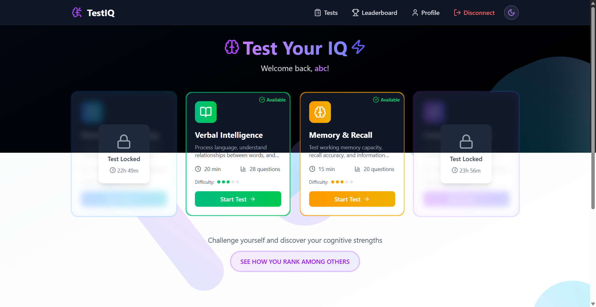

# 🧠 IQ Test App - Frontend

<div align="center">
  
  
  
  
  
  
  
  <p>
    <strong>A modern, animated cognitive assessment platform built with cutting-edge React technologies</strong>
  </p>

  <p>
    <a href="#-features">Features</a> •
    <a href="#-tech-stack">Tech Stack</a> •
    <a href="#-getting-started">Getting Started</a> •
    <a href="#-project-structure">Project Structure</a> •
    <a href="#-animations">Animations</a> •
    <a href="#-deployment">Deployment</a>
  </p>
</div>

## ✨ Features

### 🎯 Core Functionality

- **4 Cognitive Test Types**: Numerical reasoning, verbal intelligence, memory & recall, comprehensive IQ
- **Real-time Scoring**: Instant test results with detailed performance analysis
- **Smart Availability System**: 24-hour cooldown periods with visual countdown timers
- **Global Leaderboards**: Compare scores worldwide with percentile rankings
- **User Profiles**: Track cognitive development and test history over time

### 🎨 User Experience

- **Stunning Animations**: Framer Motion powered interactions and transitions
- **Responsive Design**: Optimized for all devices from mobile to desktop
- **Dark/Light Theme**: System-aware theme switching with smooth transitions
- **Loading States**: Beautiful loading animations and skeleton screens
- **Error Handling**: User-friendly error messages with recovery suggestions

### 🔐 Security & Performance

- **JWT Authentication**: Secure token-based authentication with auto-refresh
- **Server Wake-up**: Intelligent server status monitoring with wake-up animations
- **Progressive Loading**: Optimized loading with React Suspense and streaming
- **Edge Runtime**: Global performance optimization via Vercel Edge Network
- **Caching Strategy**: Smart caching for improved performance

### 🚀 Advanced Features

- **Test Selection Animations**: Interactive cards with hover effects and loading overlays
- **Real-time Timers**: Precise countdown timers with visual progress indicators
- **Animated Question Types**: Multiple choice, fill-in-gap, and memory pair questions
- **Results Visualization**: Animated score displays and progress charts
- **Server Status Monitoring**: Health checks with animated status indicators

## 🛠 Tech Stack

### Core Framework

- **[Next.js 15.3.1](https://nextjs.org/)** - React framework with App Router
- **[React 19](https://react.dev/)** - Latest React with concurrent features
- **[TypeScript](https://www.typescriptlang.org/)** - Type-safe JavaScript (via JSDoc)
- **[TailwindCSS 4](https://tailwindcss.com/)** - Utility-first CSS framework

### Animations & UI

- **[Framer Motion 12](https://www.framer.com/motion/)** - Production-ready motion library
- **[Lucide React](https://lucide.dev/)** - Beautiful & consistent icon library
- **[next-themes](https://github.com/pacocoursey/next-themes)** - Perfect theme switching

### Development & Deployment

- **[ESLint](https://eslint.org/)** - Code quality and consistency
- **[Vercel](https://vercel.com/)** - Zero-config deployment platform
- **[PostCSS](https://postcss.org/)** - CSS processing and optimization

### Key Frontend Features

#### Next.js 15 Advantages

- **Turbo Pack**: Ultra-fast bundling and hot reloading
- **App Router**: File-system based routing with layouts
- **Server Components**: Reduced JavaScript bundle size
- **Streaming SSR**: Progressive page loading
- **Edge Runtime**: Global performance optimization

#### React 19 Features

- **Concurrent Features**: Improved user experience with interruption handling
- **Automatic Batching**: Optimized state updates
- **Suspense**: Better loading state management
- **Server Components**: Hybrid rendering architecture

## 🚀 Getting Started

### Prerequisites

```bash
# Required
Node.js 20.x or higher
npm 10.x or higher

# Recommended
Git for version control
VS Code with recommended extensions
```

### Quick Start

```bash
# Clone the repository
git clone <repository-url>
cd iqtest/iqtest

# Install dependencies
npm install

# Create environment file
cp .env.example .env.local

# Start development server
npm run dev

# Open in browser
open http://localhost:3000
```

### Development Scripts

```bash
# Development with hot reload
npm run dev

# Production build
npm run build

# Start production server
npm run start

# Code quality checks
npm run lint
npm run lint:fix

# Type checking (via JSDoc)
npm run type-check
```

The application will be available at:

- **Development**: http://localhost:3000
- **Production Build**: http://localhost:3000 (after `npm run build && npm run start`)

## 📁 Project Structure

```
iqtest/                                    # Frontend root directory
├── 📁 public/                             # Static assets
│   ├── favicon.ico                        # App favicon
│   ├── manifest.json                      # PWA manifest
│   └── site.webmanifest                   # Web app manifest
├── 📁 scripts/                            # Build and utility scripts
│   └── check-api.js                       # API health check script
├── 📁 src/                                # Source code
│   ├── 📁 app/                            # Next.js 15 App Router
│   │   ├── 📁 admin/                      # Admin pages
│   │   │   └── 📁 logging-test/           # Debug logging interface
│   │   ├── 📁 api/                        # API routes (health checks)
│   │   ├── 📁 auth/                       # Authentication pages
│   │   ├── 📁 cookie-policy/              # Legal pages
│   │   ├── 📁 leaderboard/                # Ranking pages
│   │   ├── 📁 privacy-policy/             # Privacy documentation
│   │   ├── 📁 profile/                    # User profile pages
│   │   ├── 📁 terms/                      # Terms of service
│   │   ├── 📁 tests/                      # Test selection and execution
│   │   │   └── 📁 start/                  # Test in progress
│   │   ├── globals.css                    # Global styles
│   │   ├── head.js                        # HTML head configuration
│   │   ├── layout.js                      # Root layout component
│   │   └── page.js                        # Homepage
│   ├── 📁 components/                     # React components
│   │   ├── 📁 auth/                       # Authentication UI
│   │   │   └── AuthPage.js                # Unified auth interface
│   │   ├── 📁 begin/                      # Test initialization
│   │   │   ├── AgeSelector.js             # Age input component
│   │   │   ├── ConfirmButton.js           # Confirmation UI
│   │   │   └── InputRectangle.js          # Input styling
│   │   ├── 📁 constants/                  # Static data
│   │   │   └── testTypes.js               # Test type definitions
│   │   ├── 📁 home/                       # Homepage components
│   │   │   └── HomePage.js                # Landing page interface
│   │   ├── 📁 leaderboard/                # Ranking components
│   │   │   ├── GlobalRankingTable.js     # Global rankings
│   │   │   ├── LeaderboardHeader.js      # Header with stats
│   │   │   ├── LeaderboardPage.js        # Main leaderboard
│   │   │   ├── LeaderboardTabs.js        # Tab navigation
│   │   │   ├── TestSpecificRankTable.js  # Test rankings
│   │   │   └── UserRankingSummary.js     # User stats
│   │   ├── 📁 profile/                    # Profile management
│   │   │   ├── DataPrivacy.js            # GDPR compliance
│   │   │   ├── ProfilePage.js            # Main profile
│   │   │   └── TestHistory.js            # Test history display
│   │   ├── 📁 shared/                     # Reusable components
│   │   │   ├── AuthGuard.js              # Route protection
│   │   │   ├── BackendStatusModal.js     # Server status
│   │   │   ├── ConditionalFooter.js      # Smart footer
│   │   │   ├── CookieConsent.js          # GDPR cookie consent
│   │   │   ├── CountrySelect.js          # Country picker
│   │   │   ├── ErrorMessage.js           # Error display
│   │   │   ├── ErrorModal.js             # Global error modal
│   │   │   ├── Favicon.js                # Dynamic favicon
│   │   │   ├── Footer.js                 # Site footer
│   │   │   ├── FullScreenLoader.js       # Full-screen loading
│   │   │   ├── LoadingAnimation.js       # Loading spinner
│   │   │   ├── LoadingDots.js            # Animated dots
│   │   │   ├── PasswordStrengthIndicator.js # Password validation
│   │   │   ├── ServerWakeUpProvider.js   # Server status context
│   │   │   ├── ServerWakeUpScreen.js     # Wake-up animation
│   │   │   ├── StartButton.js            # Animated start button
│   │   │   ├── ThemeProvider.js          # Theme context
│   │   │   └── ThemeToggle.js            # Theme switcher
│   │   ├── 📁 start/                      # Test execution
│   │   │   ├── ClientWrapper.js          # Client-side wrapper
│   │   │   ├── Header.js                 # Test header
│   │   │   ├── NavigationButton.js       # Navigation controls
│   │   │   ├── NavigationControls.js     # Test navigation
│   │   │   ├── OptionButton.js           # Answer options
│   │   │   ├── ProgressBar.js            # Progress indicator
│   │   │   ├── TestCompletionWrapper.js  # Completion flow
│   │   │   ├── TestInProgress.js         # Active test UI
│   │   │   ├── TestProgressBar.js        # Test progress
│   │   │   ├── TestResults.js            # Results display
│   │   │   ├── TimeUpMessage.js          # Time expiry
│   │   │   ├── Timer.js                  # Countdown timer
│   │   │   └── 📁 questions/             # Question types
│   │   │       ├── FillInGapQuestion.js  # Fill-in-the-blank
│   │   │       ├── MemoryPairQuestion.js # Memory matching
│   │   │       └── MultipleChoiceQuestion.js # Multiple choice
│   │   └── 📁 tests/                      # Test selection
│   │       ├── ClientWrapper.js          # Client wrapper
│   │       ├── LoggingTestComponent.js   # Debug component
│   │       ├── TestAvailability.js       # Availability checker
│   │       ├── TestCategoryButton.js     # Test selection button
│   │       ├── TestCategoryGrid.js       # Test grid layout
│   │       ├── TestScoreDisplay.js       # Score visualization
│   │       ├── TestSelectionPage.js      # Main test selection
│   │       └── TestStartPage.js          # Test start screen
│   ├── 📁 fetch/                          # API client layer
│   │   ├── api.js                        # Base API configuration
│   │   ├── auth.js                       # Authentication API
│   │   ├── checkUsername.js              # Username validation
│   │   ├── createUser.js                 # User registration
│   │   ├── leaderboard.js                # Leaderboard API
│   │   ├── login.js                      # Login API
│   │   ├── profile.js                    # Profile API
│   │   ├── questions.js                  # Questions API
│   │   ├── results.js                    # Results API
│   │   └── tests.js                      # Tests API
│   ├── 📁 hooks/                          # Custom React hooks
│   │   └── useServerWakeUp.js            # Server status hook
│   ├── 📁 utils/                          # Utility functions
│   │   ├── cn.js                         # Tailwind class merger
│   │   ├── cookies.js                    # Cookie management
│   │   ├── fallbackQuestions.js          # Offline questions
│   │   ├── healthCheck.js                # Health check utils
│   │   ├── logger.js                     # Client-side logging
│   │   └── serverWakeup.js               # Server wake utilities
│   └── middleware.js                     # Next.js middleware
├── .eslintrc.mjs                         # ESLint configuration
├── .gitignore                            # Git ignore patterns
├── jsconfig.json                         # JavaScript configuration
├── next.config.mjs                       # Next.js configuration
├── package.json                          # Dependencies and scripts
├── postcss.config.mjs                    # PostCSS configuration
├── tailwind.config.mjs                   # Tailwind configuration
└── vercel.json                           # Vercel deployment config
```

## 🎨 Animations & UI

### Framer Motion Animations

#### Loading States

- **Full-Screen Loader**: Neural network animation with orbiting particles
- **Test Selection**: Card hover effects with loading overlays
- **Server Wake-up**: Rocket animation with progress indicators
- **Skeleton Loading**: Pulsing placeholder content

#### Interactive Elements

- **Button Animations**: Hover states with scale and color transitions
- **Page Transitions**: Smooth slide and fade animations
- **Modal Animations**: Scale and backdrop blur effects
- **Progress Indicators**: Animated progress bars and timers

#### Test Experience

- **Question Transitions**: Slide animations between questions
- **Answer Feedback**: Immediate visual feedback for selections
- **Timer Animations**: Smooth countdown with color transitions
- **Results Reveal**: Staggered score animations

### Theme System

```javascript
// Dark/Light theme with system preference detection
const themes = {
  light: {
    background: "from-gray-50 to-white",
    text: "text-gray-900",
    card: "bg-white border-gray-200",
  },
  dark: {
    background: "from-gray-950 to-black",
    text: "text-white",
    card: "bg-gray-900 border-gray-700",
  },
};
```

## 🔐 Authentication Flow

### Security Implementation

1. **JWT Tokens**: 15-minute access tokens with refresh mechanism
2. **HTTP-only Cookies**: Secure token storage
3. **Auto-redirect**: Seamless authentication flow
4. **Route Protection**: AuthGuard component for private routes
5. **Token Refresh**: Silent background token renewal

### User Experience Flow

```
Landing Page → Auth Page → Test Selection → Test Execution → Results → Leaderboard
     ↓              ↓              ↓               ↓           ↓         ↓
  Theme Toggle   Registration   Availability    Real-time   Score     Rankings
  Server Status   Login Form    Checking        Timer       Display   Comparison
```

## 🧪 Test Types & Features

| Test Type     | Questions | Duration | Difficulty | Features                  |
| ------------- | --------- | -------- | ---------- | ------------------------- |
| **Numerical** | 20        | 25 min   | ⭐⭐⭐     | Math, Logic, Patterns     |
| **Verbal**    | 20        | 30 min   | ⭐⭐⭐     | Language, Comprehension   |
| **Memory**    | 15        | 22 min   | ⭐⭐⭐     | Pattern, Recall, Matching |
| **Mixed**     | 16        | 45 min   | ⭐⭐⭐⭐⭐ | All Categories Combined   |

### Question Types

- **Multiple Choice**: Standard A/B/C/D format with radio buttons
- **Fill-in-Gap**: Text input with validation
- **Memory Pairs**: Interactive card matching with flip animations

### Test Features

- **24-hour Cooldowns**: Prevents test farming with visual timers
- **Progress Tracking**: Real-time progress bars and question counters
- **Auto-save**: Answers saved automatically during test
- **Time Warnings**: Visual alerts when time is running low

## ⚙️ Configuration

### Environment Variables

Create `.env.local` file:

```bash
# Backend API URLs
NEXT_PUBLIC_DIRECT_BACKEND_URL=https://iqtest-server-project.onrender.com
NEXT_SERVER_API_URL=https://iqtest-server-project.onrender.com

# For local development
# NEXT_PUBLIC_DIRECT_BACKEND_URL=http://localhost:5164
# NEXT_SERVER_API_URL=http://localhost:5164

# Optional: Analytics and monitoring
# NEXT_PUBLIC_ANALYTICS_ID=your-analytics-id
```

### Next.js Configuration

**next.config.mjs**:

```javascript
/** @type {import('next').NextConfig} */
const nextConfig = {
  experimental: {
    optimizePackageImports: ["lucide-react"],
  },
  images: {
    remotePatterns: [
      {
        protocol: "https",
        hostname: "iqtest-server-tkhl.onrender.com",
      },
    ],
  },
  // Enable edge runtime for better performance
  runtime: "edge",
};

export default nextConfig;
```

### Tailwind Configuration

**tailwind.config.mjs**:

```javascript
import { fontFamily } from "tailwindcss/defaultTheme";

/** @type {import('tailwindcss').Config} */
export default {
  darkMode: ["class"],
  content: ["./src/**/*.{js,ts,jsx,tsx,mdx}"],
  theme: {
    extend: {
      fontFamily: {
        sans: ["var(--font-sans)", ...fontFamily.sans],
      },
      animation: {
        "fade-in": "fadeIn 0.5s ease-in-out",
        "slide-up": "slideUp 0.3s ease-out",
        "pulse-slow": "pulse 3s infinite",
      },
    },
  },
  plugins: [],
};
```

## 🚢 Deployment

### Vercel Deployment (Recommended)

The application is optimized for **Vercel** deployment:

#### Automatic Deployment

```bash
# Connect GitHub repository to Vercel
# Automatic deployments on push to main branch

# Manual deployment
npm install -g vercel
vercel --prod
```

#### Build Configuration

```json
{
  "buildCommand": "npm run build",
  "outputDirectory": ".next",
  "installCommand": "npm install",
  "devCommand": "npm run dev",
  "framework": "nextjs"
}
```

#### Environment Variables

Set in Vercel dashboard:

- `NEXT_PUBLIC_DIRECT_BACKEND_URL`
- `NEXT_SERVER_API_URL`

### Docker Deployment

**Dockerfile**:

```dockerfile
FROM node:20-alpine AS base
WORKDIR /app
COPY package*.json ./
RUN npm ci --only=production

FROM node:20-alpine AS build
WORKDIR /app
COPY package*.json ./
RUN npm ci
COPY . .
RUN npm run build

FROM node:20-alpine AS production
WORKDIR /app
COPY --from=base /app/node_modules ./node_modules
COPY --from=build /app/.next ./.next
COPY --from=build /app/public ./public
COPY --from=build /app/package.json ./package.json

EXPOSE 3000
CMD ["npm", "start"]
```

### Performance Optimizations

- **Code Splitting**: Automatic route-based splitting
- **Image Optimization**: Next.js Image component
- **Font Optimization**: Built-in font optimization
- **Caching**: Aggressive caching strategies
- **Bundle Analysis**: Built-in bundle analyzer

## 📊 Performance Metrics

### Lighthouse Scores (Target)

- **Performance**: 95+
- **Accessibility**: 100
- **Best Practices**: 100
- **SEO**: 95+

### Core Web Vitals

- **LCP**: < 2.5s (Largest Contentful Paint)
- **FID**: < 100ms (First Input Delay)
- **CLS**: < 0.1 (Cumulative Layout Shift)

## 🧪 Testing

### Development Testing

```bash
# Run development server
npm run dev

# Build and test production
npm run build
npm run start

# Lint code
npm run lint
npm run lint:fix
```

### Browser Testing

- **Chrome DevTools**: Performance profiling
- **Lighthouse**: Performance auditing
- **React DevTools**: Component debugging
- **Framer Motion DevTools**: Animation debugging

## 🔍 Browser Support

### Supported Browsers

- **Chrome/Edge**: Latest 2 versions
- **Firefox**: Latest 2 versions
- **Safari**: Latest 2 versions
- **Mobile Safari/Chrome**: Latest versions

### Polyfills Included

- **CSS Grid**: Automatic fallbacks
- **Flexbox**: Cross-browser compatibility
- **ES6+ Features**: Via Next.js transpilation

## 📱 Progressive Web App (PWA)

### PWA Features

- **Web App Manifest**: Install prompt on mobile
- **Service Worker**: Offline capability (basic)
- **Responsive Design**: Works on all screen sizes
- **App-like Experience**: Full-screen mobile experience

## 📄 License

This project is [MIT](../LICENSE) licensed.

---

<div align="center">
  <p>Built with ❤️ using Next.js 15 and React 19</p>
  <p>
    <a href="https://iqtest-app.vercel.app">Live Application</a> •
    <a href="../IqTest-server/README.md">Backend Documentation</a> •
    <a href="../.claude/README.md">Project Overview</a>
  </p>
</div>
